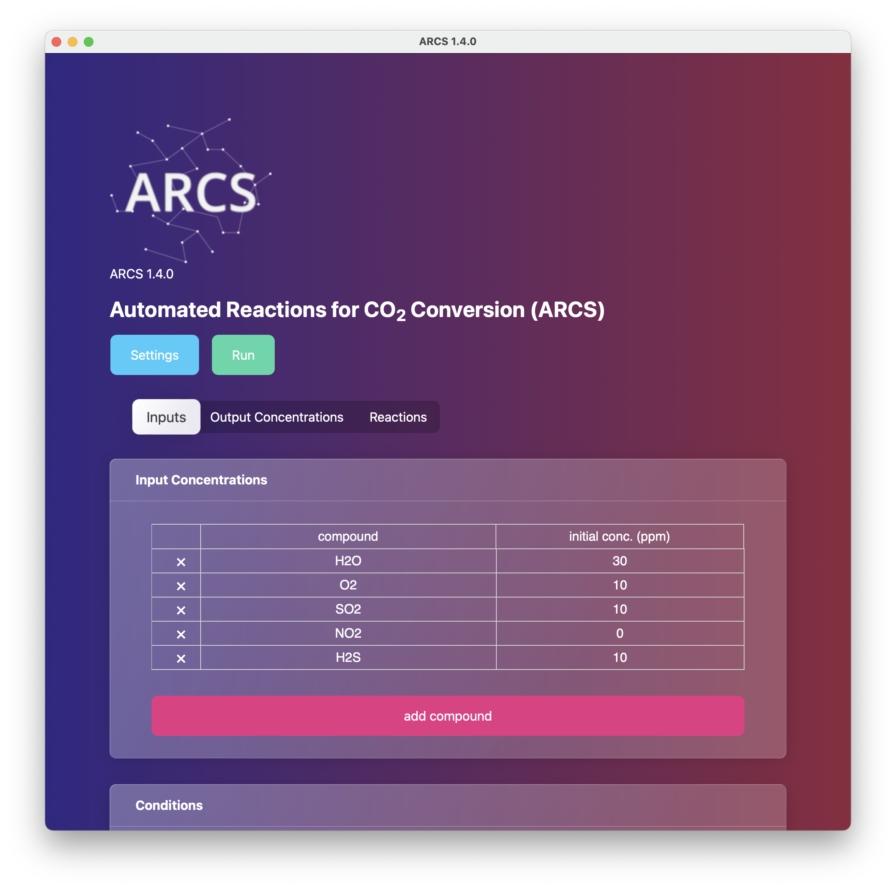

# ARCS
<p align="center">
 
</p>


Automated Reactions for CO<sub>2</sub> Storage

Version 1.4.0

## Installation

`pip install . `

## User Interface  

The user interface is created using the DASH framework

The `arcs-app` can be run from the `app` directory in the terminal through; 

```
python app/arcs-app
```

new data can be applied by placing in the 

```
app/data
```

directory 


<p align="center">
 
</p>
